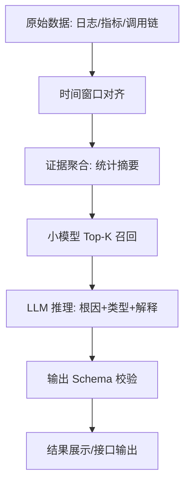

第三部分：基于大小模型协同的故障根因定位数据集跑通与工程实现
0 工作说明与目标
本部分用于完成导师提出的“在调研基础上跑通一个数据集，理解其中关键技术”的实践任务。围绕 AIOps2020 数据集，完成了从原始数据接入、样本构建、小模型基线验证，到大模型输入准备与端到端流程跑通的完整工程实践。该部分工作的重点不在于模型效果对比，而在于通过实际跑通数据，理解大小模型协同在故障根因定位任务中的作用方式，以及各工程环节之间的数据流与职责划分。

---
1 数据集来源与整体结构理解
实验使用的数据集为 AIOps2020，数据统一存放于本地路径
d:\Graduation_Project\data\aiops2020。
数据由两类核心内容构成。第一类是故障事件清单文件 故障整理（预赛）.csv，该文件作为整个工程的数据索引入口，记录了每一次故障的关键信息。其中，log_time 字段用于标记故障发生时间，是后续时间窗口对齐的基准；name 字段表示根因组件名称，作为根因定位的标签；fault_type 字段表示故障类型，用于分类任务；此外，object、kpi、container 等字段用于描述故障发生的上下文环境。
第二类数据为按天存储的多源观测数据，每一天的数据以压缩包形式提供，解压后包含平台指标、业务指标以及调用链指标等 CSV 文件。工程中采用“按天解压、按事件过滤”的方式访问这些数据，从而在保证效率的同时避免重复 I/O。

示例（故障清单中的真实记录）：
index=1, object=docker, fault_desrcibtion=CPU fault, kpi=container_cpu_used,
name=docker_003, container=container_001, log_time=2020/4/11 0:05, duration=5min

---
2 时间窗口对齐与多源证据提取
所有数据处理均围绕故障发生时间 log_time 展开。核心思想是以故障时间为中心构建固定时间窗口，在该窗口范围内对多源观测数据进行切片和聚合，从而形成语义一致的故障证据集合。
在工程实现中，数据解压与日级数据准备由脚本 pipeline/extract_day.py 完成，该脚本负责解压指定日期的数据包并加载当日所有指标文件。在事件级处理中，通过设置统一的 window_before 与 window_after 参数，在 log_time 前后截取时间范围，使日志、指标和调用链数据在同一时间语义下对齐。
采用时间窗口的原因在于，故障往往并非瞬时事件，而是伴随一段时间内的异常波动。统一的窗口策略既可以捕捉故障前后的异常趋势，也保证了不同数据源在同一事件粒度下可复现。

示例（时间窗口对齐的具体用法）：
若 log_time=2020/4/11 0:05，设置 window_before=10min、window_after=10min，
则窗口范围为 2020/4/10 23:55 ~ 2020/4/11 0:15。
在该范围内的指标与调用链记录将作为该事件的候选证据。

---
3 证据聚合方式与统计摘要设计
考虑到原始日志与指标数据规模大、噪声高，工程中并未直接将原始记录作为模型输入，而是通过统计方式将证据聚合为摘要信息。证据聚合逻辑主要由 pipeline/build_sft_samples.py 实现。
在该脚本中，不同数据源采用不同的统计方式：平台指标聚合为出现次数、均值、最大值与最小值；调用链指标聚合为调用次数、平均耗时以及成功率；业务指标聚合为请求总数、平均响应时间与成功率。这些统计量能够保留异常趋势信息，同时显著压缩输入规模，避免模型在大量细节中丢失重点。
证据聚合采用“单日文件级一次读取、事件级多路累积”的方式实现，即每个 CSV 文件只扫描一次，在扫描过程中同时为同一天内的多个故障事件更新统计结果，从而显著降低整体运行时间。

示例（原始记录的真实样例行）：
- 平台指标（dcos_docker.csv）：
  name=container_cpu_used, timestamp=1586534402000, value=2.000000, cmdb_id=docker_004
- 调用链指标（trace_csf.csv）：
  startTime=1586534660852, elapsedTime=361.0, success=True, cmdb_id=os_021, serviceName=csf_001
- 业务指标（esb.csv）：
  serviceName=osb_001, startTime=1586534400000, avg_time=0.333, num=1, succee_rate=1.0

示例（统计摘要的结构与数值，简化展示）：
- 平台指标（按 name 聚合）：
  container_cpu_used: count=1, avg=2.0, min=2.0, max=2.0
- 调用链指标（按 cmdb_id 聚合）：
  os_021: count=2, avg_elapsed=1097.5, success_rate=1.0
- 业务指标（按 serviceName 聚合）：
  osb_001: count=4, avg_time≈0.52, avg_success_rate=1.0, total_num=1063

---
4 SFT 样本构建与输出组织
在完成证据聚合后，构建监督微调（SFT）样本。样本构建仍由 pipeline/build_sft_samples.py 完成，其流程包括：读取故障清单文件、为每个故障事件构建时间窗口、聚合多源证据，并生成结构化样本。
生成的样本以 JSONL 格式输出，路径为
output/sft_samples_YYYY_MM_DD.jsonl。
 每条样本包含三部分内容：故障事件元信息、证据摘要以及对应的根因组件与故障类型标签。通过该方式，原始复杂数据被转换为可直接用于模型训练的监督样本。
为验证样本规模与分布合理性，使用 pipeline/sft_stats.py 对生成样本进行统计分析，检查不同故障类型与根因组件的分布情况，从而判断数据是否存在明显偏置。
**训练数据扩充**：通过 pipeline/batch_build_sft.py 对多日数据批量生成 SFT 样本，并支持多组时间窗口预设（--window-presets，格式为 before,after;before,after…）。同一故障事件在不同窗口下会生成多条样本，从而在不增加故障事件数量的前提下扩充训练规模。例如使用 30 组窗口（2～40 分钟对称及部分非对称如 5,10;10,5;15,20;20,15）时，样本量约在 900 条左右。扩充后需重新执行 pipeline/build_llm_inputs.py 生成 output/llm_inputs_v4.jsonl，训练脚本中 MAX_SAMPLES=0 表示使用全部样本，MAX_STEPS=0 表示按 1 个 epoch 自动计算步数。

示例（SFT 样本结构节选，基于上述样例构造）：
{
  "fault_event": {
    "object": "docker",
    "kpi": "container_cpu_used",
    "root_cause_component": "docker_003",
    "container": "container_001",
    "log_time": "2020/4/11 0:05"
  },
  "evidence": {
    "platform": {
      "dcos_docker.csv": {
        "container_cpu_used": {"count": 1, "avg": 2.0, "min": 2.0, "max": 2.0}
      }
    },
    "trace": {"trace_csf.csv": {"os_021": {"count": 2, "avg_elapsed": 1097.5, "success_rate": 1.0}}},
    "business": {"esb.csv": {"osb_001": {"count": 4, "avg_time": 0.52, "avg_success_rate": 1.0, "total_num": 1063}}}
  },
  "output": {"fault_type": "CPU fault", "root_cause_component": "docker_003"}
}

---
5 小模型基线与根因 Top-K 候选生成
在引入大模型之前，首先构建小模型基线，用于验证数据有效性并生成根因候选集合。基础方案通过 pipeline/small_model_rootcause_topk.py 实现，其核心思想是在时间窗口内统计不同组件的出现频次，并按频次排序输出 Top-K 候选根因，通过 Hit@K 指标评估候选覆盖能力。
在此基础上，引入加权 Top-K 方法，由 pipeline/small_model_rootcause_weighted_topk.py 实现。该方法在频次基础上进一步考虑异常强度与失败惩罚，例如平台指标的异常幅度、调用链的时延与失败率以及业务指标的成功率变化。通过权重设计，使异常程度更高的组件在排序中优先级更高，从而降低“高频但非根因”组件的干扰。
相关参数通过批量评估与对比脚本进行分析，包括 pipeline/batch_rootcause_weighted_topk.py、pipeline/compare_topk_summaries.py 与 pipeline/grid_search_topk.py，用于寻找更合理的权重组合。

---
6 大模型输入构建与大小模型协作方式
在完成小模型候选生成后，构建大模型输入样本。该步骤由 pipeline/build_llm_inputs.py 完成，其核心思想是将小模型生成的 Top-K 候选作为约束条件嵌入大模型输入中。
大模型输入采用统一结构，包括任务指令、故障事件信息、证据摘要以及 Top-K 候选集合。生成的输入样本输出为
output/llm_inputs_v4.jsonl。
通过这种设计，大模型不再在全量组件空间中进行推测，而是在候选集合内进行解释性推理，从而提升输出稳定性与可信度。这种“先筛选、再解释”的协作方式，是大小模型协同的核心思想之一。

示例（llm_inputs_v4.jsonl 中的真实样例，已做适度裁剪）：
{
  "instruction": "给定观测证据与候选根因列表，输出根因组件与故障类型，并给出简要解释。",
  "input": {
    "fault_event": {
      "index": "1",
      "object": "docker",
      "fault_description": "CPU fault",
      "kpi": "container_cpu_used",
      "name": "docker_003",
      "container": "container_001",
      "log_time": "2020-04-11 00:05:00",
      "window_start": "2020-04-11 00:00:00",
      "window_end": "2020-04-11 00:10:00"
    },
    "evidence": {
      "platform_metrics": {
        "dcos_docker.csv": {
          "matched_rows": 81,
          "metrics": [
            {"metric": "container_cpu_used", "count": 9, "avg": 24.111111, "min": 1.0, "max": 98.0}
          ]
        }
      },
      "trace_metrics": {
        "trace_remote_process.csv": {
          "matched_rows": 641,
          "services": [
            {"service": "csf_001", "count": 641, "avg_elapsed": 5658.936037, "success_rate": 1.0}
          ]
        }
      },
      "business_metrics": {
        "esb.csv": {
          "matched_rows": 15,
          "services": [
            {"service": "osb_001", "count": 15, "avg_time": 8.534867, "avg_succee_rate": 0.971867, "total_num": 2935}
          ]
        }
      }
    },
    "top_candidates": ["docker_003", "docker_002", "docker_001", "docker_004", "docker_005"]
  },
  "output": {
    "root_cause_component": "docker_003",
    "fault_type": "CPU fault",
    "kpi": "container_cpu_used",
    "related_container": "container_001"
  }
}
完整单条样例（含 platform_metrics、trace_metrics、business_metrics 等完整字段）见 output/llm_inputs_v4.jsonl 首行及后续行，每行一条 JSON。

---
7 输出结构化与校验机制
为保证推理结果在工程上可用，系统定义了统一的 JSON 输出 Schema，详细说明位于 research/输出JSON_Schema.md。所有模型输出在进入后续流程前，均需通过 pipeline/validate_rca_output.py 进行结构校验，以自动识别字段缺失或类型错误，避免自由文本结果直接进入系统。
结构化输出与校验机制确保了结果不仅在语义上合理，而且在接口、展示与存储层面可直接使用。

---
8 端到端流程跑通验证
在完成各模块实现后，通过端到端脚本 pipeline/run_end_to_end.ps1 对单日数据进行完整流程验证。该脚本从数据解压开始，依次执行样本构建、候选生成、大模型输入生成以及输出校验，最终生成包括 SFT 样本、大模型输入样本与校验报告在内的完整输出结果。
这一验证过程证明了从原始数据到结构化根因定位结果的整条链路在工程上是可运行的。

验证结果（输出校验报告与样例）：
- 校验报告：output/rca_output_v4_report.json
  total=11, invalid=0, errors=[]
- 结构化输出样例（rca_output_v4.jsonl 节选）：
  {"event_id":"1","time":"2020-04-11 00:05:00","top_candidates":["docker_003","docker_002","docker_001","docker_004","docker_005"],"prediction":{"root_cause_component":"docker_003","fault_type":"CPU fault","kpi":"container_cpu_used","related_container":"container_001","explanation":""}}

解释：
该结果表示在 2020-04-11 当日的端到端流程中，共生成 11 条结构化输出，全部通过 JSON Schema 校验（invalid=0，errors 为空），说明输出字段完整、类型正确且可被系统直接解析。样例中包含 event_id、time、Top‑K 候选及 prediction 结果，表明从故障事件 → 证据聚合 → 候选生成 → 结构化输出的链路已闭环跑通，可作为后续 SFT/GRPO 或系统展示的稳定输入。

大模型 SFT 训练与评估也已在本机跑通：使用 output/llm_inputs_v4.jsonl 作为训练数据，pipeline/train_qwen2_5_7b_qlora_demo.py 进行 QLoRA 微调，微调前/后在同一评估集上计算可解析率、根因 Top‑1 与故障类型准确率，结果与解读见 v2_doc/训练评估报告.md 与 v2_doc/训练评估结果.json。

---
9 阶段性结论
通过对 AIOps2020 数据集的完整跑通，可以确认基于大小模型协同的根因定位框架在数据准备、候选生成与推理流程上的可行性。小模型 Top-K 能有效缩小搜索空间，大模型输入与输出结构为后续监督微调与强化优化奠定了数据与工程基础。本阶段工作的核心成果在于构建了一条可复现、可扩展的端到端流程，为后续模型训练与性能提升提供了稳定起点。

---
10 实验环境构建与配置（明确模型、框架与硬件）
10.1 当前实际环境（已完成的数据跑通阶段）
- 操作系统：Windows 10（本机）
- Python：3.11+
- 依赖框架：pandas / numpy / scikit‑learn（数据处理与小模型基线）
- 运行范围：完成数据解压、样本构建、Top‑K 基线、LLM 输入生成与输出校验

10.2 明确模型选择（大小模型）
- 大模型（LLM）：Qwen2.5‑7B‑Instruct（中文指令能力强、适合 LoRA 微调）
- 小模型：两类并行小模型  
  1) 根因候选 Top‑K：加权统计模型（small_model_rootcause_weighted_topk.py）  
  2) 故障类型分类：频次基线（small_model_baseline.py）

说明：当前阶段已完成“数据与流程”，并在本地完成 Qwen2.5-7B 的 QLoRA SFT 训练与评估；模型选择与输入格式已固定，训练脚本与评估结果见 v2_doc（训练评估报告.md、训练评估结果.json）。

10.3 训练与微调框架
- 训练框架：Hugging Face Transformers + PEFT（LoRA/QLoRA）
- 量化：bitsandbytes（4-bit QLoRA，降低显存压力）
- 训练目标：SFT（监督微调）；后续可在此基础上进行 GRPO

10.4 硬件配置（建议/目标）
- 本机实际配置（SFT 已在本机跑通）：
  - CPU：Intel i7-14650HX；内存：32GB DDR5
  - GPU：NVIDIA RTX 4070 Laptop 8GB；CUDA 12.1
  - 7B 模型 QLoRA（4-bit）：在上述配置下可完成训练与评估
- 数据处理与样本构建：CPU 即可完成
- SFT 建议配置：7B 模型 QLoRA 约需 8GB 显存可运行，16GB 更稳定；CPU 内存 32GB 建议
- GRPO（若执行）：建议 24GB+ 显存或多卡并行

---
11 实验数据、任务定义与测试指标
11.1 具体任务定义（输入/输出）
- 输入：任务指令 + 故障事件（fault_event）+ 证据摘要（evidence）+ Top‑K 候选（top_candidates）
- 输出：root_cause_component + fault_type + 解释（explanation，可选）

11.2 测试指标
- 根因定位：Top‑1 Accuracy（根因是否命中）
- 候选召回：Hit@K（是否包含在 Top‑K）
- 故障类型：Accuracy
- 输出格式：Schema 合规率（invalid 数量）

11.3 测试数据（节选一组真实样例）
样例 1（来自 output/llm_inputs_v4.jsonl）：
- 输入要点：object=docker, kpi=container_cpu_used, top_candidates=[docker_003,...]
- 标签输出：root_cause_component=docker_003, fault_type=CPU fault

样例 2（来自 output/llm_inputs_v4.jsonl）：
- 输入要点：object=docker, fault_description=network delay, top_candidates=[docker_001,docker_004,docker_003,docker_002,docker_008]
- 标签输出：root_cause_component=docker_002, fault_type=network delay

样例 3（来自 output/llm_inputs_v4.jsonl）：
- 输入要点：object=db, fault_description=db connection limit, top_candidates=[docker_003,...]
- 标签输出：root_cause_component=db_007, fault_type=db connection limit

11.4 微调前后性能变化（记录口径与实测结果）
- 记录口径：基线（未微调 LLM）与 SFT 后均统计可解析率（输出可解析为合法 JSON 的比例）、根因 Top‑1、故障类型 Accuracy。
- 实测结果（评估集 40 条，训练 614 条样本、4-bit QLoRA、1 epoch 自动步数）：

| 模型状态 | 根因 Top‑1 | 故障类型 Acc | 可解析率 |
|---|---|---|---|
| 微调前（基座 Qwen2.5-7B） | 0.650 | 1.000 | 40/40 |
| 微调后（QLoRA SFT） | 0.850 | 0.925 | 40/40 |

- 说明：扩充训练数据后，微调后根因 Top‑1 由 0.65 提升至 0.85，故障类型准确率 0.925，可解析率保持 100%。详细数值见 v2_doc/训练评估结果.json，解读见 v2_doc/训练评估报告.md。

---
12 方案设计与整体架构（大小模型协同）
12.1 协同逻辑与职责
- 小模型负责“召回”：基于统计与异常强度生成 Top‑K 根因候选，保证召回率与效率
- 大模型负责“精判与解释”：在候选集合中选择根因并输出故障类型与解释
- 协同节奏：每个故障事件触发一次小模型 Top‑K；大模型仅在候选集合内推理

12.2 协同频率
- 事件级协同：每个故障事件触发一次 Top‑K + LLM 推理
- 若在线部署：可按告警事件触发（非固定时间轮询）

12.3 整体架构图（文本版）
