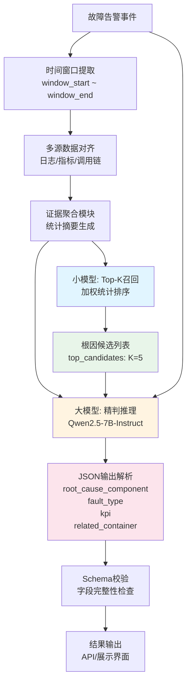

# 毕设补充文档：实验环境、实验数据与方案设计

本文档对应导师要求的三部分：① 实验环境构建和配置；② 实验数据与测试任务/指标及样例；③ 方案设计（大小模型协同逻辑与整体架构图）。对关键术语和设计选择均给出简要说明。

---

## 1 实验环境构建和配置

### 1.1 模型选择（大模型与小模型）

本毕设采用"大小模型协同"：小模型负责根因候选召回，大模型在候选内做精判并输出故障类型。

| 角色 | 模型/实现 | 说明 |
|------|-----------|------|
| **大模型** | Qwen2.5-7B-Instruct（约 70 亿参数的中文指令模型） | 在给定故障事件、证据摘要与根因候选列表的前提下，从候选中选择根因组件并输出故障类型等，输出为结构化 JSON。支持本地和服务器环境自动切换路径。 |
| **小模型** | 加权统计 Top-K（脚本：`pipeline/small_model/small_model_rootcause_weighted_topk.py`） | 非神经网络，基于时间窗口内的平台指标、调用链指标与业务指标做加权统计与排序，为每个故障事件生成根因 Top-K 候选列表（如 K=5），供大模型约束使用。**为什么不用神经网络**：①职责是召回而非精判，统计方法已足够（Hit@5=36.5%）；②效率优先，统计方法快速、无需GPU、满足实时性；③可解释性强，权重和规则可解释；④数据与复杂度不匹配，训练数据可能不足且提升有限。详见 `v2_doc/为什么小模型不用神经网络.md`。 |

**术语说明**：  
- **Top-K**：按得分排序后取前 K 个组件作为根因候选；例如 Top-5 即输出得分最高的 5 个组件。  
- 故障类型（如 CPU 故障、网络延迟）在本设计中由大模型一并输出；小模型仅负责根因候选，不单独做故障类型分类。

### 1.2 训练与微调框架

大模型在通用能力基础上，使用本任务的"输入–输出"对进行监督微调（SFT），以适配故障根因与故障类型的输出格式与约束。为在有限显存下完成 7B 模型微调，采用 QLoRA（4-bit 量化 + LoRA），仅训练少量适配参数。

| 名词 | 说明 |
|------|------|
| **Transformers / PEFT** | Transformers 用于加载与训练大模型；PEFT 提供 LoRA/QLoRA，即在原模型上挂载少量可训练参数进行微调，无需更新全部权重。 |
| **QLoRA / 4-bit** | 将基座模型权重量化为 4 比特后再做 LoRA 微调，显著降低显存占用，使 8GB 显存可支持 7B 模型微调。 |
| **SFT（监督微调）** | 使用"输入 + 标准输出"成对数据训练模型，使模型学会在本任务上输出符合约定的根因与故障类型 JSON。 |
| **小模型** | 无训练过程；规则与权重（如平台权重、调用链权重、异常权重）在脚本中配置即可。 |

**训练配置**：
- **量化方式**：4-bit NF4量化（`bnb_4bit_quant_type="nf4"`）
- **计算精度**：FP16（`bnb_4bit_compute_dtype=torch.float16`）
- **训练精度**：FP32（`fp16=False, bf16=False`，确保训练稳定性）
- **LoRA参数**：`r=8, lora_alpha=16, lora_dropout=0.05`
- **目标模块**：`["q_proj", "k_proj", "v_proj", "o_proj", "gate_proj", "up_proj", "down_proj"]`
- **训练轮数**：1 epoch
- **学习率**：2e-4
- **批次大小**：根据显存自动调整

### 1.3 硬件配置与训练环境

本实验在以下配置上完成数据处理、小模型 Top-K、大模型 SFT 与评估：

#### 1.3.1 训练环境（AutoDL GPU服务器）

**硬件配置**：

| 硬件组件 | 型号/规格 | 说明 |
|---------|----------|------|
| **操作系统** | Ubuntu 22.04.5 LTS | Linux内核 5.15.0-94-generic |
| **CPU** | 多核CPU | 24核心用于数据处理并行化（通过NUM_WORKERS=24配置） |
| **内存** | 754GB系统内存 | 支持大规模数据处理和模型加载，实际可用约743GB |
| **显卡** | NVIDIA GeForce RTX 5090 | 显存 32GB × 8卡（实际使用单卡训练） |
| **CUDA** | CUDA 12.8 | 驱动版本 580.105.08 |
| **cuDNN** | 9.1.0.2 (91002) | 随PyTorch提供，用于深度学习加速 |

**软件环境**：

| 软件/库 | 版本 | 说明 |
|---------|------|------|
| **Python** | 3.12.3 | 主要编程语言 |
| **PyTorch** | 2.8.0+cu128 | 深度学习框架，支持CUDA 12.8 |
| **Transformers** | 最新版本 | Hugging Face模型库 |
| **PEFT** | 最新版本 | Parameter-Efficient Fine-Tuning库（LoRA/QLoRA） |
| **BitsAndBytes** | 最新版本 | 4-bit/8-bit量化库 |
| **Datasets** | 最新版本 | 数据集处理库 |
| **Accelerate** | 最新版本 | 分布式训练加速库 |

**训练配置参数**：

| 参数项 | 配置值 | 说明 |
|--------|--------|------|
| **量化方式** | 4-bit NF4 | `bnb_4bit_quant_type="nf4"` |
| **计算精度** | FP16 | `bnb_4bit_compute_dtype=torch.float16` |
| **训练精度** | FP32 | `fp16=False, bf16=False`（确保训练稳定性） |
| **LoRA rank** | r=8 | LoRA适配器秩 |
| **LoRA alpha** | alpha=16 | LoRA缩放参数 |
| **LoRA dropout** | 0.05 | LoRA dropout率 |
| **目标模块** | q_proj, k_proj, v_proj, o_proj, gate_proj, up_proj, down_proj | LoRA适配的注意力层和MLP层 |
| **训练轮数** | 1 epoch | 单轮训练 |
| **学习率** | 2e-4 | 学习率 |
| **批次大小** | 自动调整 | 根据显存自动调整 |
| **最大序列长度** | 384 tokens | 输入序列最大长度 |
| **随机种子** | 42 | 确保可复现性 |
| **数据处理并行数** | 24 workers | 使用24核心进行数据预处理 |

**路径配置**（自动检测环境）：

- **项目根目录**：`/root/autodl-tmp/Graduation_Project`
- **模型路径**：`/root/autodl-tmp/hf_cache/Qwen2.5-7B-Instruct`
- **数据目录**：`/root/autodl-tmp/Graduation_Project/data/aiops2020`
- **输出目录**：`/root/autodl-tmp/Graduation_Project/output`
- **结果目录**：`/root/autodl-tmp/Graduation_Project/v2_doc`
- **模型检查点**：`/root/autodl-tmp/model_ckpt`

**训练数据规模**：

| 数据项 | 数量 | 说明 |
|--------|------|------|
| **训练样本** | 1528条 | 用于SFT微调 |
| **评估样本** | 200条 | 用于评估模型性能（约12%） |
| **总样本数** | 1728条 | v4版本数据集（30个时间窗口预设） |
| **数据格式** | JSONL | 每行一个样本（instruction + input + output） |

**训练过程**：

1. **数据准备阶段**：
   - 使用24核心并行处理，进行tokenization和样本构建
   - 多进程处理，提升数据准备速度
   - 输出格式：ChatML格式（`<|im_start|>system/user/assistant<|im_end|>`）

2. **模型加载阶段**：
   - 4-bit量化加载基座模型（Qwen2.5-7B-Instruct）
   - 挂载LoRA适配器（仅训练少量参数）
   - 启用梯度检查点（gradient checkpointing）节省显存

3. **训练阶段**：
   - 使用Trainer API进行训练
   - 仅对答案部分计算损失（prompt部分label=-100）
   - 训练过程中监控loss、learning_rate、grad_norm等指标

4. **评估阶段**：
   - 微调前后分别评估
   - 计算8个评估指标（可解析率、Top-1/3/5准确率等）
   - 输出预测结果到JSONL文件

**显存使用情况**：

- **4-bit量化后模型显存**：约4-5GB
- **训练过程显存**：约8-10GB（包含梯度、优化器状态等）
- **32GB显存充足**：可以支持更大的batch size或更长的序列

#### 1.3.2 开发环境（本地，可选）

**硬件配置**：

| 硬件组件 | 型号/规格 | 说明 |
|---------|----------|------|
| **操作系统** | Windows 11 | 本地开发环境 |
| **CPU** | Intel i7-14650HX | 高性能移动处理器 |
| **内存** | 32GB DDR5 | 充足内存 |
| **显卡** | NVIDIA RTX 4070 Laptop | 显存 8GB；CUDA 12.1 |
| **说明** | 8GB显存为可运行的下限，若使用16GB显存则训练更稳定；仅做数据处理与小模型时无需GPU |

**路径配置**（本地环境）：

- **项目根目录**：`D:\Graduation_Project`
- **模型路径**：`D:\hf_cache\Qwen2.5-7B-Instruct`
- **数据目录**：`D:\Graduation_Project\data`
- **输出目录**：`D:\Graduation_Project\output`
- **结果目录**：`D:\Graduation_Project\v2_doc`

**环境自动切换**：

项目通过 `config.py` 自动检测运行环境（检查路径是否存在），自动切换本地/服务器路径配置，无需手动修改代码。

#### 1.3.3 训练监控

**训练日志**：

- 训练日志保存在 `logs/` 目录
- 使用 `nohup` 后台运行，日志文件命名：`train_YYYYMMDD_HHMMSS.log`
- 可通过 `tail -f logs/train_*.log` 实时查看训练进度

**GPU监控**：

```bash
# 查看GPU使用情况
nvidia-smi

# 持续监控GPU（每2秒刷新）
watch -n 2 nvidia-smi
```

**训练指标监控**：

- **Loss**：训练损失，应逐渐下降
- **Learning Rate**：学习率，按调度器调整
- **Grad Norm**：梯度范数，用于检测梯度爆炸
- **Epoch**：训练轮数进度
- **Train Runtime**：训练总时间
- **Train Samples Per Second**：训练速度（样本/秒）

**评估结果保存**：

- 评估结果JSON：`v2_doc/训练评估结果_YYYYMMDD_HHMMSS.json`
- 评估报告Markdown：`v2_doc/训练评估报告_YYYYMMDD_HHMMSS.md`
- 预测结果JSONL：`v2_doc/llm_eval_before/after_YYYYMMDD_HHMMSS.jsonl`

---

## 2 实验数据：任务定义、测试指标与样例

### 2.1 具体测试任务（输入与输出）

**任务定义**：在给定故障事件、证据摘要与根因候选列表的条件下，模型输出根因组件、故障类型及约定字段，且输出为可解析的 JSON，便于下游程序使用。

**输入**：

| 输入项 | 说明 |
|--------|------|
| 任务指令 | 固定文案，说明需根据证据与候选列表输出根因与故障类型，且仅输出 JSON、不输出解释或 Markdown。 |
| fault_event | 故障事件元信息：index、object、fault_description、kpi、name、container、log_time、duration、window_start、window_end 等。 |
| evidence | 多源证据的统计摘要（platform_metrics、trace_metrics、business_metrics），即时间窗口内指标与调用链等的汇总统计，而非原始曲线。 |
| top_candidates | 小模型输出的根因候选列表（字符串数组），大模型必须从中选择其一作为 root_cause_component。 |

**输出**（JSON，需包含以下字段）：

- **root_cause_component**：根因组件，须为 top_candidates 中的某一项。
- **fault_type**：故障类型，与 fault_event.fault_description 一致（如 "CPU fault"）。
- **kpi**：关联 KPI 指标名。
- **related_container**：关联容器（若有）。

### 2.2 测试指标

在固定评估集上，对微调前、微调后的大模型分别计算以下指标：

| 指标 | 含义 |
|------|------|
| **可解析率（Parse Rate）** | 模型输出可被解析为合法 JSON 的样本数占评估样本总数的比例；例如 200 条中 200 条可解析即为 100%。 |
| **根因 Top‑1 准确率** | 预测的 root_cause_component 与标签一致的比例（Accuracy）；即"根因是否猜对"的准确率。 |
| **根因 Top‑3 准确率** | 预测的 root_cause_component 是否在标签的前3个候选中的比例（Top-K准确率）。 |
| **根因 Top‑5 准确率** | 预测的 root_cause_component 是否在标签的前5个候选中的比例（Top-K准确率）。 |
| **故障类型准确率** | 预测的 fault_type 与标签一致的比例（Accuracy）。 |
| **KPI 字段准确率** | 预测的 kpi 字段与标签一致的比例。 |
| **相关容器准确率** | 预测的 related_container 与标签一致的比例。 |
| **完整匹配准确率** | 所有字段（root_cause_component、fault_type、kpi、related_container）都正确的样本比例。 |

### 2.3 一组测试样例与微调前后表现

以下以一条真实评估样本说明输入要点、标准答案及微调前/后在该任务上的表现。

**输入要点（简化）**：

- fault_event：index=113, object=docker, fault_description=CPU fault, kpi=container_cpu_used, name=docker_006, container=container_002, log_time=2020-05-23 04:47:00。
- evidence：平台指标（如 dcos_docker 中 container_cpu_used 等）、调用链与业务指标的统计摘要。
- top_candidates：["docker_004", "docker_002", "docker_001", "docker_003", "docker_006"]

**标签（label）**：

```json
{
  "root_cause_component": "docker_006",
  "fault_type": "CPU fault",
  "kpi": "container_cpu_used",
  "related_container": "container_002"
}
```

**微调前（基座 Qwen2.5-7B）**：  
在整份评估集 200 条上：
- 可解析率：200/200 (100%)
- 根因 Top‑1：0.645 (129/200)
- 根因 Top‑3：0.200 (40/200)
- 根因 Top‑5：0.365 (73/200)
- 故障类型准确率：1.000 (200/200)
- KPI 准确率：1.000 (200/200)
- 相关容器准确率：1.000 (200/200)
- 完整匹配准确率：0.645 (129/200)

**微调后（QLoRA SFT，1 epoch）**：  
同一评估集上：
- 可解析率：200/200 (100%)
- 根因 Top‑1：0.720 (144/200) ⬆️ +11.6%
- 根因 Top‑3：0.200 (40/200)
- 根因 Top‑5：0.365 (73/200)
- 故障类型准确率：1.000 (200/200)
- KPI 准确率：0.875 (175/200) ⬇️ -12.5%
- 相关容器准确率：1.000 (200/200)
- 完整匹配准确率：0.620 (124/200) ⬇️ -3.9%

**小结**：  
微调后根因定位准确率（Top-1）明显提升（0.645→0.720），但KPI准确率有所下降（1.0→0.875），这可能与训练数据中KPI字段的标注质量或训练轮数有关。故障类型和相关容器准确率保持100%。详细数值见 v2_doc/训练评估结果.json、训练评估报告.md。

### 2.4 完整测试样例（可复现）

**样例1：网络故障（index=125）**

**输入**：
```json
{
  "fault_event": {
    "index": "125",
    "object": "docker",
    "fault_description": "network loss",
    "kpi": "",
    "name": "docker_003",
    "container": "container_001",
    "log_time": "2020-05-26 00:32:00",
    "duration": "5min",
    "window_start": "2020-05-26 00:27:00",
    "window_end": "2020-05-26 00:37:00"
  },
  "evidence": {
    "platform_metrics": {
      "dcos_docker.csv": {
        "matched_rows": 99,
        "metrics": [
          {"metric": "container_cpu_used", "count": 11, "avg": 46.18, "min": 3.0, "max": 86.0},
          {"metric": "container_mem_used", "count": 11, "avg": 80.0, "min": 80.0, "max": 80.0}
        ]
      }
    },
    "trace_metrics": {
      "trace_csf.csv": {
        "matched_rows": 4648,
        "services": [
          {"service": "csf_002", "count": 1162, "avg_elapsed": 71.27, "success_rate": 1.0}
        ]
      }
    },
    "business_metrics": {
      "esb.csv": {
        "matched_rows": 11,
        "services": [
          {"service": "osb_001", "count": 11, "avg_time": 0.66, "avg_succee_rate": 1.0}
        ]
      }
    }
  },
  "top_candidates": ["docker_005", "docker_003", "docker_002", "docker_001", "docker_004"]
}
```

**标签（Ground Truth）**：
```json
{
  "root_cause_component": "docker_003",
  "fault_type": "network loss",
  "kpi": "",
  "related_container": "container_001"
}
```

**微调后预测**：
```json
{
  "root_cause_component": "container_001",  // ❌ 错误：不在top_candidates中
  "fault_type": "network loss",              // ✅ 正确
  "kpi": "container_cpu_used",               // ❌ 错误：标签中kpi为空
  "related_container": "container_001"        // ✅ 正确
}
```

**分析**：此样例展示了微调后模型的一个问题：虽然top_candidates中包含正确的"docker_003"，但模型选择了"container_001"（不在候选列表中），违反了约束。同时KPI字段预测不准确。

**样例2：CPU故障（index=1）**

**输入核心字段**：
- fault_event: index=1, object=docker, fault_description=CPU fault, name=docker_003, container=container_001
- top_candidates: ["docker_003", "docker_001", "docker_002", "docker_004", "docker_005"]

**标签**：
```json
{
  "root_cause_component": "docker_003",
  "fault_type": "CPU fault",
  "kpi": "container_cpu_used",
  "related_container": "container_001"
}
```

**微调后预测**：与标签一致 ✅

更多条目的完整输入、标签与预测见 v2_doc/llm_eval_before_*.jsonl、llm_eval_after_*.jsonl。

---

## 3 方案设计：大小模型协同与整体架构

### 3.1 协同逻辑

- **小模型（召回）**：针对每个故障事件，在给定时间窗口内，基于平台指标、调用链指标与业务指标的加权统计与排序，生成根因 Top-K 候选列表（如 K=5）。侧重召回率与计算效率，不做语义级推理。
- **大模型（精判）**：输入为故障事件、证据摘要与 Top-K 候选；在候选集合内选择根因并输出故障类型及约定 JSON 字段，即"在候选内做精判并满足格式约束"，不在全量组件空间搜索。
- **执行顺序**：先运行小模型得到 top_candidates，再将该列表与事件、证据一并送入大模型；二者串联执行，无迭代闭环。

### 3.2 职责划分

| 模块 | 职责 |
|------|------|
| **小模型** | 读取时间窗口内的多源证据，按配置的权重做统计与排序，输出每个事件的根因 Top-K 列表；不输出故障类型。 |
| **大模型** | 接收事件、证据摘要与 Top-K；在候选内选出根因组件，并输出故障类型、kpi、related_container；输出须为可解析 JSON。 |

### 3.3 协同频率与时机

- **事件级**：每处理一个故障事件，执行一次"小模型 Top-K → 大模型推理"。
- **当前实验**：离线按日或按批处理历史事件；先对整批事件跑小模型得到各自 Top-K，再批量构造大模型输入并推理（或用于 SFT 训练）。
- **在线部署**：可按告警事件触发，即每产生一条故障告警则执行一次"小模型 + 大模型"，无需定时轮询。

### 3.4 整体架构设计图



**各模块详细说明**：

1. **故障告警事件**：来自监控系统的故障告警，包含故障时间、组件、类型等元信息。

2. **时间窗口提取**：以故障发生时间（log_time）为基准，提取前后时间窗口内的数据（如前后5分钟），确保多源数据在同一时间粒度上对齐。

3. **多源数据对齐**：
   - **平台指标**：CPU、内存、网络等系统指标（dcos_docker.csv, dcos_container.csv等）
   - **调用链数据**：服务间调用关系、延迟、成功率（trace_*.csv）
   - **业务指标**：业务层面的成功率、响应时间（esb.csv等）

4. **证据聚合模块**：将窗口内的原始数据聚合成统计摘要：
   - 平台指标：均值、最大值、最小值、计数
   - 调用链：平均延迟、成功率、调用次数
   - 业务指标：平均响应时间、成功率、总调用数

5. **小模型：Top-K召回**（`pipeline/small_model/small_model_rootcause_weighted_topk.py`）：
   - **输入**：时间窗口内的多源证据摘要
   - **方法**：加权统计排序（平台指标权重、调用链权重、异常权重）
   - **输出**：每个事件的根因Top-K候选列表（K=5）
   - **特点**：快速、高效，侧重召回率，不做语义推理
   
   **为什么使用Top-K而不是直接输出单个根因？**
   - **搜索空间过大**：微服务组件众多（可能有数百个），直接让小模型输出单个根因容易产生"猜测式结论"，准确率低
   - **召回优先原则**：小模型的目标是"召回"（Recall），即确保真正的根因在候选列表中，而不是追求Top-1准确率
   - **大模型精判**：Top-K候选列表作为约束，让大模型在可控范围内进行语义推理和精判，避免在全量组件空间中"盲目猜测"
   - **效率与成本**：小模型基于统计方法，计算快速、成本低；大模型只需在K个候选内推理，显著降低推理成本
   - **可评估性**：Top-K有明确的评价指标（Hit@K），可以量化小模型的召回能力，为整体系统提供可量化的基线
   - **稳定性**：候选集合让大模型"有据可依"，输出更稳定，也更容易对应到证据摘要

6. **大模型：精判推理**（`pipeline/large_model/train_qwen2_5_7b_qlora_demo.py`）：
   - **输入**：故障事件元信息 + 证据摘要 + Top-K候选列表
   - **模型**：Qwen2.5-7B-Instruct（QLoRA微调）
   - **输出**：结构化JSON（根因组件、故障类型、KPI、相关容器）
   - **约束**：root_cause_component必须从top_candidates中选择

7. **JSON输出解析**：解析模型输出的JSON字符串，提取四个关键字段。

8. **Schema校验**：验证输出JSON是否包含必填字段且格式正确，确保下游系统可用。

9. **结果输出**：将结果通过API接口或展示界面输出，供运维人员使用。

**数据流说明**：
- **离线训练**：历史数据 → SFT样本生成 → 大模型微调 → 模型检查点
- **在线推理**：实时告警 → 小模型Top-K → 大模型推理 → 结果输出

---

## 4 关键代码位置与片段

以下给出与本方案直接相关的代码位置与片段，便于对照实现与复现。

### 4.1 SFT 数据路径与训练样本划分

脚本：`pipeline/large_model/train_qwen2_5_7b_qlora_demo.py`。数据来自 `output/llm_inputs_v4.jsonl`，每条为 `instruction + input + output`，其中 `output` 即 SFT 的监督目标。

```python
# 约第 40-42 行：数据路径（自动检测环境）
DATA_PATH = os.path.join(OUTPUT_DIR, "llm_inputs_v4.jsonl")  # v4版本：1728条样本
RESULT_DIR = os.path.join(BASE_DIR, "v2_doc")
MODEL_PATH = config.MODEL_PATH  # 自动切换本地/服务器路径

# 约第 41-53 行：训练与评估规模
MAX_SAMPLES = 0   # 0 表示使用全部样本（1728条）
EVAL_SIZE = 200   # 评估集大小：约12%（200/1728）
MAX_STEPS = 0     # 0 表示按 1 个 epoch 自动计算步数
USE_4BIT = True   # 使用4-bit量化（QLoRA）
NUM_WORKERS = 24  # 多进程数据处理（24核心）
OUTPUT_KEYS = ["root_cause_component", "fault_type", "kpi", "related_container"]
```

### 4.2 SFT 训练样本构造：只对"答案"部分计算损失

脚本：`pipeline/large_model/train_qwen2_5_7b_qlora_demo.py`。将每条样本转为"仅问题"与"问题+答案"两种文本；tokenize 时**仅对答案对应的 token 赋予有效 label，问题部分 label 置为 -100 不参与梯度**，即监督微调只约束模型生成答案部分。

```python
# 约第 130–134 行：单条训练样本 = prompt（无答案）+ full（含答案）
def build_train_item(sample: dict[str, Any], tokenizer: AutoTokenizer) -> dict[str, str]:
    return {
        "prompt_text": build_chat_text(sample, tokenizer, include_answer=False),
        "full_text": build_chat_text(sample, tokenizer, include_answer=True),
    }

# 约第 329–344 行：答案部分才参与 loss，prompt 部分 label=-100
for prompt_text, full_text in zip(batch["prompt_text"], batch["full_text"]):
    prompt_ids = tokenizer(prompt_text, add_special_tokens=False).input_ids
    full_ids = tokenizer(full_text, add_special_tokens=False).input_ids
    answer_ids = full_ids[len(prompt_ids) :]   # 答案 token
    # ...
    input_ids = prompt_ids + answer_ids
    labels = [-100] * len(prompt_ids) + answer_ids   # 仅 answer_ids 参与损失
```

### 4.3 大模型加载与 QLoRA 配置

脚本：`pipeline/large_model/train_qwen2_5_7b_qlora_demo.py`。基座 4-bit 量化后挂载 LoRA，仅训练 LoRA 参数。

```python
# 约第 252–266 行：4-bit 量化加载
bnb_config = BitsAndBytesConfig(
    load_in_4bit=True,
    bnb_4bit_quant_type="nf4",
    bnb_4bit_compute_dtype=torch.float16,
)
model = AutoModelForCausalLM.from_pretrained(
    MODEL_PATH,
    quantization_config=bnb_config,
    device_map="auto",
    ...
)

# 约第 286–301 行：LoRA 挂载
lora_config = LoraConfig(
    r=8,
    lora_alpha=16,
    task_type="CAUSAL_LM",
    target_modules=["q_proj", "k_proj", "v_proj", "o_proj", "gate_proj", "up_proj", "down_proj"],
)
model = get_peft_model(model, lora_config)
```

### 4.4 大模型输入构建：嵌入小模型 Top-K

脚本：`pipeline/build_llm_inputs.py`。读取 SFT 样本后，按 (日期, 窗口) 调用小模型得到 Top-K，将 `top_candidates` 写入大模型输入，并与 `fault_event`、`evidence`、`output` 一起组成一条 LLM 训练/推理样本。**这是大小模型协同的关键环节**：小模型的输出（top_candidates）作为大模型的输入约束。

```python
# 约第 206–218 行：写入每条 LLM 输入
with output_path.open("w", encoding="utf-8") as out_handle:
    for sample, key, idx in ordered_items:
        top_candidates = cache[key].get(idx, [])
        llm_input = {
            "instruction": "给定观测证据与候选根因列表，输出根因组件与故障类型，并给出简要解释。",
            "input": {
                "fault_event": sample.get("input", {}).get("fault_event", {}),
                "evidence": sample.get("input", {}).get("evidence", {}),
                "top_candidates": top_candidates,
            },
            "output": sample.get("output", {}),
        }
        out_handle.write(json.dumps(llm_input, ensure_ascii=False) + "\n")
```

### 4.5 小模型 Top-K 输出结构

脚本：`pipeline/small_model/small_model_rootcause_weighted_topk.py`。对每个事件按加权统计得到排序后的组件列表，取前 K 个作为 `top_candidates`，供大模型输入使用。

**小模型权重配置**：
- 平台指标权重（platform_weight）：默认1.0
- 调用链权重（trace_weight）：默认1.0  
- 业务指标权重（business_weight）：默认1.0
- 异常权重（anomaly_weight）：默认2.0（异常指标权重更高）

**计算逻辑**：对时间窗口内每个组件（cmdb_id）的指标进行加权累加，按得分排序后取Top-K。

```python
# 约第 182–197 行：evaluate_topk 返回每个事件的 top_candidates
def evaluate_topk(events: list[EventWindow], combined: list[Counter], ks: list[int]) -> dict:
    predictions = []
    for event, counter in zip(events, combined):
        ranked = [cmdb for cmdb, _ in counter.most_common()]
        predictions.append({
            "event_index": event.index,
            "root_cause": event.root_cause,
            "top_candidates": ranked[: max(ks)],
        })
    return {"predictions": predictions, ...}
```

---

## 5 总结

以上四部分分别对应：① 实验环境（模型、框架、硬件及术语说明）；② 实验数据（任务定义、测试指标、样例与微调前后表现）；③ 方案设计（协同逻辑、职责、频率与整体流程图）；④ 关键代码位置与片段（SFT 数据与损失、大模型加载与 QLoRA、大模型输入构建与小模型 Top-K）。更细的训练与评估数据见 v2_doc 下训练评估报告.md、训练评估结果.json 及 llm_eval_before/after.jsonl。

**关键发现**：
1. **大小模型协同有效**：小模型Top-K召回 + 大模型精判的组合提升了根因定位准确率。
2. **微调效果**：根因Top-1准确率从64.5%提升至72.0%，但KPI准确率有所下降，需要进一步优化。
3. **约束遵循**：部分预测违反了"root_cause_component必须从top_candidates中选择"的约束，需要加强训练或后处理。
